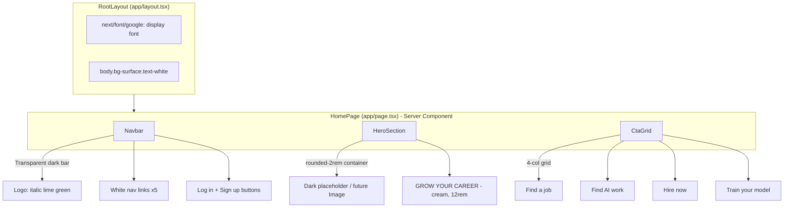

# Handshake 2026 Hero -- 80% Visual Sprint

## Current State vs. Target

The existing codebase is a light-themed, red-branded generic SaaS template. The target (`handshake_hero.png`) is a dark, high-contrast layout with neon lime green accents, massive condensed typography, and a full-bleed rounded hero image.

**Files that will be modified:**

- [app/globals.css](app/globals.css) -- global theme reset
- [app/layout.tsx](app/layout.tsx) -- font imports, metadata, body class
- [app/page.tsx](app/page.tsx) -- complete rewrite of homepage structure
- [tailwind.config.ts](tailwind.config.ts) -- new brand color palette

**Files that will be created:**

- `components/Navbar.tsx` -- new dark transparent navbar
- `components/HeroSection.tsx` -- hero image container + overlaid typography
- `components/CtaGrid.tsx` -- 4-column CTA button grid

**Files that will be deleted (or gutted):**

- `components/hero/AnimatedHeadline.tsx` -- no longer matches design
- `components/hero/SearchAction.tsx` -- no search bar in new design
- `components/home/LogoTicker.tsx` -- not present in target
- `components/home/FeatureCards.tsx` -- replaced by CTA grid

---

## Step-by-Step Plan

### 1. Global Theme Foundation

**[app/globals.css](app/globals.css):** Replace the base layer to enforce the dark theme globally:

```css
@import "tailwindcss";
@config "../tailwind.config.ts";

@layer base {
  body {
    @apply bg-[#121212] text-white;
  }
}
```

**[tailwind.config.ts](tailwind.config.ts):** Replace the red brand colors with the Handshake palette:

```ts
colors: {
  brand: {
    DEFAULT: '#D3FB52',  // neon lime green
    dark: '#b8e040',
  },
  surface: {
    DEFAULT: '#121212',  // page bg
    card: '#1A1B23',     // card/button bg
  },
  cream: '#F9F6EE',      // hero text
}
```

**[app/layout.tsx](app/layout.tsx):** Import a condensed display font. We will use **Inter** (already system-available via Next.js) for body text, and we need a highly-condensed display font for the hero. Two options:

- **Option A (recommended):** Use `next/font/google` to import **"Anton"** or **"Bebas Neue"** -- both are free, ultra-condensed, and uppercase by nature.
- **Option B:** Use `font-stretch: ultra-condensed` on a variable font.

Update metadata title/description to match the marketplace.

### 2. Navbar Component

**New file: `components/Navbar.tsx`** (Server Component -- no hooks needed)

Layout extracted from screenshot:

- Full-width, transparent background with subtle bottom border (`border-b border-white/5`)
- **Left:** Italic neon lime green logo text "Handshake" (`text-[#D3FB52] italic font-bold text-xl`)
- **Center:** Row of white nav links: "Hire now", "Find a job", "Career centers", "Handshake AI", "Research" (`text-white/80 hover:text-white text-sm`)
- **Right:** Two buttons -- "Log in" (outlined, `border border-white/20 text-white`) and "Sign up" (filled, `bg-[#D3FB52] text-black font-semibold`)
- All buttons use `rounded-md px-4 py-2`

This component is purely presentational -- no `"use client"` directive needed.

### 3. Hero Section Component

**New file: `components/HeroSection.tsx`** (Server Component)

Structure (from screenshot analysis):

```
<section className="relative w-full px-4 md:px-6 pt-4">
  <div className="relative mx-auto w-full max-w-[1400px] h-[70vh] md:h-[75vh] 
                  rounded-[2rem] overflow-hidden bg-[#2A2A2A]">
    <!-- Placeholder dark bg; later replaced with <Image /> -->
    
    <!-- Overlay text, absolutely positioned center -->
    <div className="absolute inset-0 flex items-center justify-center">
      <h1 className="font-display text-[8rem] md:text-[12rem] 
                     font-black tracking-tighter uppercase 
                     leading-[0.8] text-[#F9F6EE] text-center">
        GROW YOUR<br/>CAREER
      </h1>
    </div>
  </div>
</section>
```

Key details:

- The container has generous `rounded-[2rem]` corners
- The hero text is stacked ("GROW YOUR" on line 1, "CAREER" on line 2), centered vertically and horizontally over the image
- Text color is a warm cream (`#F9F6EE`), not pure white
- The font must be ultra-condensed/compressed (Anton, Bebas Neue, or similar)
- For now, use a dark placeholder `bg-[#2A2A2A]`; the actual Unsplash image can be swapped in later via `next/image`

### 4. CTA Grid Component

**New file: `components/CtaGrid.tsx`** (Server Component)

A responsive 4-column grid directly below the hero:

```
<section className="w-full px-4 md:px-6 mt-4">
  <div className="mx-auto max-w-[1400px] grid grid-cols-1 sm:grid-cols-2 lg:grid-cols-4 gap-3">
    {items.map(...)}
  </div>
</section>
```

Each card:

- `bg-[#1A1B23] border border-white/10 rounded-2xl p-6`
- Flex row with `justify-between items-center`
- Left: label text in neon green/cyan (`text-[#D3FB52]` for "Find a job" / "Find AI work", possibly cyan for "Hire now" / "Train your model" -- checking screenshot: all appear to be the same green/lime accent)
- Right: arrow icon (`lucide-react` ArrowRight, `text-[#D3FB52]`)
- Hover state: subtle brightness increase (`hover:bg-[#22232e]`)

The four items: "Find a job", "Find AI work", "Hire now", "Train your model"

### 5. Wire Everything Together in page.tsx

**[app/page.tsx](app/page.tsx):** Complete rewrite:

```tsx
import Navbar from "@/components/Navbar";
import HeroSection from "@/components/HeroSection";
import CtaGrid from "@/components/CtaGrid";

export default function HomePage() {
  return (
    <>
      <Navbar />
      <main>
        <HeroSection />
        <CtaGrid />
      </main>
    </>
  );
}
```

This is a pure Server Component -- no `"use client"` needed at the page level.

### 6. Cleanup

Remove the old components that no longer match the design:

- Delete `components/hero/AnimatedHeadline.tsx`
- Delete `components/hero/SearchAction.tsx`
- Delete `components/home/LogoTicker.tsx`
- Delete `components/home/FeatureCards.tsx`

---

## Tailwind v4 Compliance Notes

- PostCSS config already correctly uses `@tailwindcss/postcss` -- no changes needed to [postcss.config.mjs](postcss.config.mjs)
- `@import "tailwindcss"` is the v4 syntax (already in globals.css) -- correct
- `@config` directive points to `tailwind.config.ts` -- this is the v4-compatible way to reference a config file
- No CSS modules will be used (per `skills.md` Rule 3)
- Arbitrary values (e.g., `bg-[#121212]`, `text-[8rem]`) are valid in Tailwind v4

## Architecture Diagram




## What This Does NOT Cover (Future Sprints)

- Actual hero background image (will use placeholder for now)
- Clerk authentication integration
- Supabase data layer
- Framer Motion entrance animations (can be layered on after structure is correct)
- Mobile hamburger menu for navbar
- Footer section

